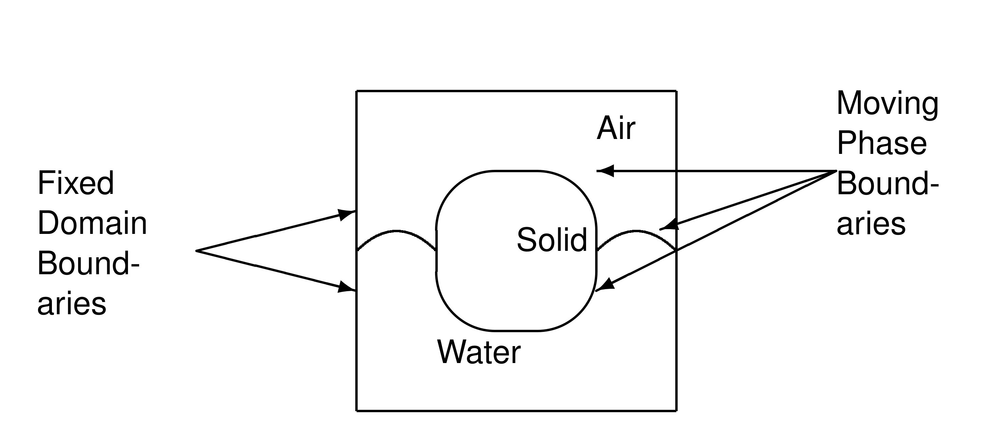
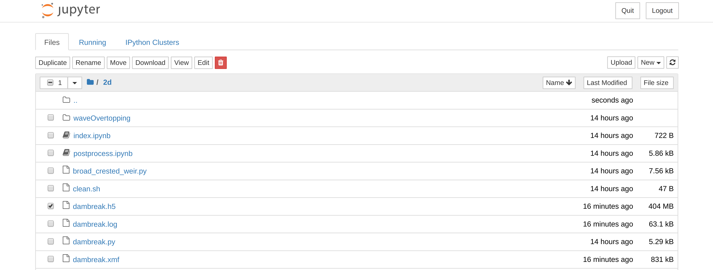
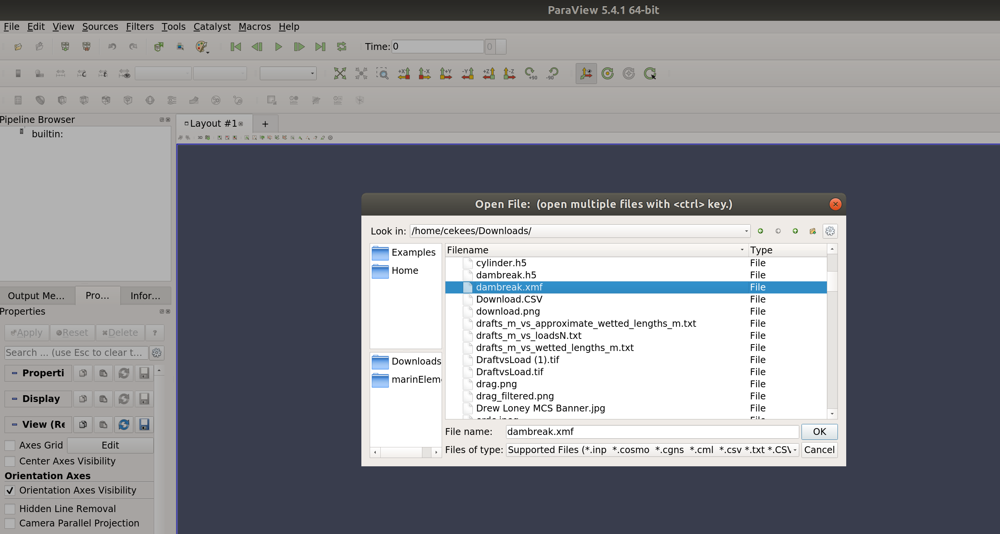
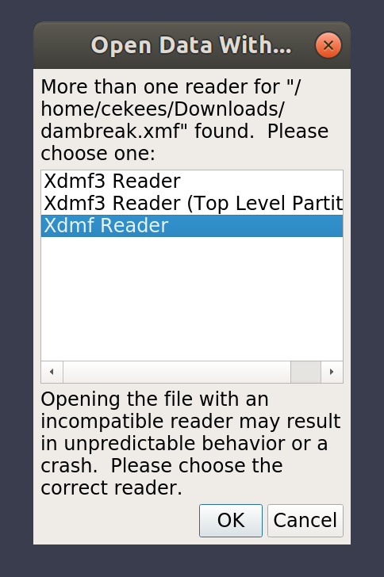
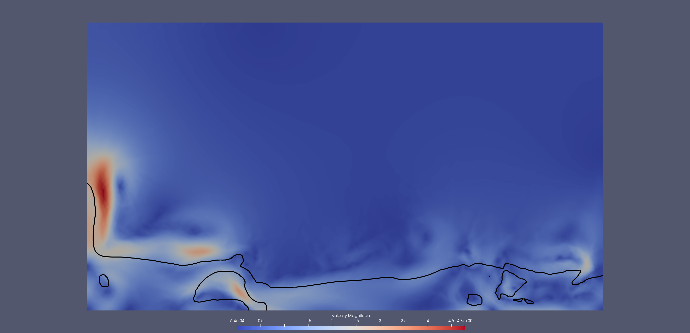

## Start your Docker environment
* We will use a Docker container to provide a uniform environment for the tutorial. A similar environment is available on the web and on the DoD HPCMP systems, and it can also be built natively.
* Run the following in a terminal, PowerShell, etc.
    ~~~
    $ docker volume create 2019-08-26-pt
    $ docker pull erdc/proteus_tutorial
    $ docker run -it -p 8888:8888 -v 2019-08-26-pt:/home/jovyan/tutorial/data erdc/proteus_tutorial jupyter notebook
    ~~~
    {: .language-bash}
* You should see some output that includes the lines
    ~~~
    ...
    [I 14:39:14.510 NotebookApp] The Jupyter Notebook is running at:
    [I 14:39:14.510 NotebookApp] http://(d196289a7ce5 or 127.0.0.1):8888/?token=e6d08b401efa97023f4c3adccd491a25f08d3a3ce3bcfe9b
    ~~~
    {: .output}
* Paste that URL into your browser. For example, [http://127.0.0.1:8888/?token=e6d08b401efa97023f4c3adccd491a25f08d3a3ce3bcfe9b](http://127.0.0.1:8888/?token=e6d08b401efa97023f4c3adccd491a25f08d3a3ce3bcfe9b).

> ## What do these commands do?
>
> *   A Docker container is intended to provide a reproducible snapshot of an environment. Thus, when you start (or restart) the "erdc/proteus_tutorial" container, you get exactly what was originally built, which means any work you did in the container earlier is lost.  Instead of requiring you to create new snapshots, we attach persistent storage. 
> *   In the first command, we create the persistent storage volume called "2019-08-26-pt". This is managed by the docker system and will be mounted in the container. In fact, it can be mounted in multiple containers.
> *   In the second command, we download the container that we will be using for the tutorial, [erdc/proteus_tutorial](https://cloud.docker.com/u/erdc/repository/docker/erdc/proteus_tutorial).
> *   In the last command, we run the jupyter notebook, attaching the persistent storage and forwarding the container's port 8888 to your machine's port 8888.
{: .callout}

## Modeling Two-Phase Flow 
* We wish to model surface water flow around fixed and moving structures.
* More specificaly, we wish to include processes such as static and dynamic free-surface waves, flow over and under structures, and moored/free-floating/navigating structures.
* These process include non-hydrostatic pressure effects, viscous effects, and dynamic, fully three-dimensional velocity distributions, including turbulence.
* To model the free-surface dynamics accurately and robustly, we model both the air phase and the water phase, with the interface between the two-phases (the free surface) modeled as the zero contour of a signed distance function (also known as the level set approach).

  

* The basic outputs of a Proteus two-phase flow model are the pressure, velocity, and the level set field.

## Running a Proteus two-phase flow model from the command line

* The proteus Command Line Interface (CLI) is accessed with the `parun` command.
* To run a basic dambreak case run the following in a jupyter notebook terminal
    ~~~
    $ cd 2d
    $ parun --TwoPhaseFlow dambreak.py -l 1 -v
    ~~~
    {: .language-bash}
    ~~~
    [       2] Running Proteus version 1.7.0
    [      19] Setting initial conditions
    [      21] Starting time stepping
    [      21] ==============================================================
    [      21] Solving over interval [ 0.00000e+00, 1.00000e-03]
    [      21] ==============================================================
    ...
    ~~~
    {: .output}

> ## What does this command do?
>
> *   First, it starts the Python interpreter and load the Proteus Python package.
> *   Next, the "--TwoPhaseFlow dambreak.py" option tells it to load a specific two-phase flow model from "dambreak.py".
> *   Lastly, the "-l 1 -v" option tells the Proteus package to use a logging level of 1 and to be verbose (print the logging to the screen).
{: .callout}

> ## Getting help on the CLI
>
> How do you find out about "parun" options?
>
> > ## Solution
> > A common convention for command line utilities is to provide a "-h" or "--help" option, and proteus maintains this convention:
> >
> > ~~~
> > $ parun -h
> > ~~~
> > {: .language-bash}
> > ~~~
> > Usage: parun [options] main.py [soModule.py] [pModule.py nModule.py]
> >
> > Options:
> >  -h, --help            show this help message and exit
> >  -I INSPECT, --inspect=INSPECT
> >                        Inspect namespace at 't0','user_step'
> > ...
> > ~~~
> > {: .output}
> {: .solution}
{: .challenge}

## Proteus models are Python modules.

*   In theis example the model is defined in the Python module "dambreak.py"
*   The ".py" extension lets everyone (including the operating system) know it is Python code.
*   It's common to write Proteus models using a text editor, but we will also use the Jupyter Notebook.

> ## Getting help on a model 
>
> What additional options are available for the dambreak case?
>
> > ## Solution
> > Proteus models can have their own context options. These are aspects of the simulation that you might wish to change without modifying the Python code for the model. To see the options, pass "?" to the "-C" (context) option.
> >
> > ~~~
> > $ parun --TwoPhaseFlow dambreak.py -C "?"
> > ~~~
> > {: .language-bash}
> > ~~~
> > Context input options:
> > final_time[3.0] Final time for simulation
> >
> > dt_output[0.01] Time interval to output solution
> >
> > cfl[0.9] Desired CFL restriction
> > 
> > he[0.01] he relative to Length of domain in x
> >
> > refinement[3] level of refinement
> > ~~~
> > {: .output}
> {: .solution}
{: .challenge}

## Proteus model output

* Proteus stores the results of model runs in [HDF5](https://portal.hdfgroup.org/display/HDF5/HDF5).
* It also stores metadata on the data following the [XDMF](https://xdmf.org) convetions.
* [ParaView](https://paraview.org) can be used to visualize the data archive.
* Select the "dambreak.xmf" file and then click on Download.

  

* Do the same for "dambreak.h5"

## Opening model output with ParaView
* Start ParaView, select "File", then "Open", then "dambreak.xmf".

  

* Select the XDMF reader to handle the file.

  

* Select "Accept" then select the velocity field.

  

> ## Visualize the air/water interface
>
> Proteus represents the air/water interface (water surface) as the zero contour of signed distance field "phi". Use ParaView to plot the zero contour as a black line.
>
> > ## Solution
> > ParaView organizes visualization as a series of "filters" applied to the data. You can find the available filters, including the "Contour" filter, in the Filters menu. Then select the "phi" field and enter the value of the contour you wish to plot (0.0).
> {: .solution}
{: .challenge}

